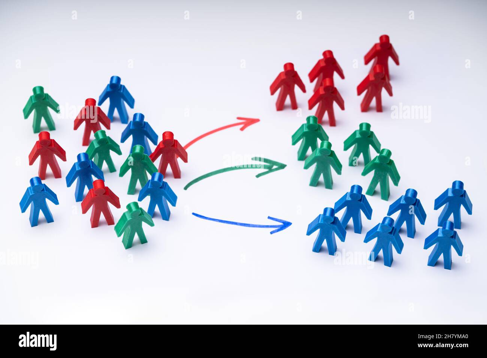

# Unsupervised Machine Learning for Customer Segmentation on Marketing Data set using Python

 ## Overview
 
In this project, we will use machine learning to transform marketing departments and perform customer segmentation. We will start by importing and visualizing a dataset of customer marketing. Then, we will learn about the k-means clustering algorithm and how to obtain the optimal number of clusters using the elbow method. We will then apply the k-means algorithm in Scikit-Learn to perform customer segmentation. Finally, we will apply Principal Component Analysis (PCA) technique to perform dimensionality reduction and data visualization

## The Approach
### Task 1: Introduction
Understand the problem statement and business case 

### Task 2: Import libraries and datasets
Import Customer Marketing dataset and prepare it for the analysis by checking NaN/missing Values.

### Task 3: Find the Optimal number of Clusters using Elbow Method
Obtain the optimal number of clusters

### Task 4: Implementing K-Means method 
Apply k-means using Scikit-Learn to perform customer segmentation

### Task 5: Apply Principal Component Analysis (PCA) and Visualize the results
Apply Principal Component Analysis (PCA) technique to perform dimensionality reduction and data visualization

